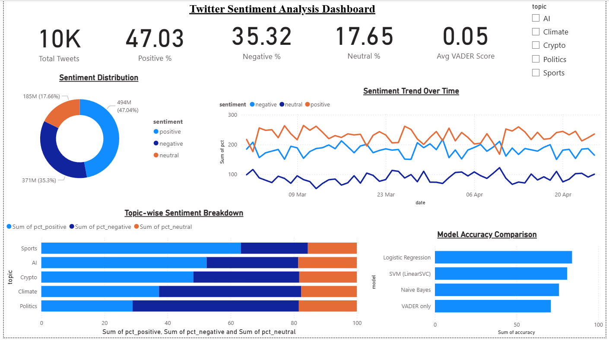
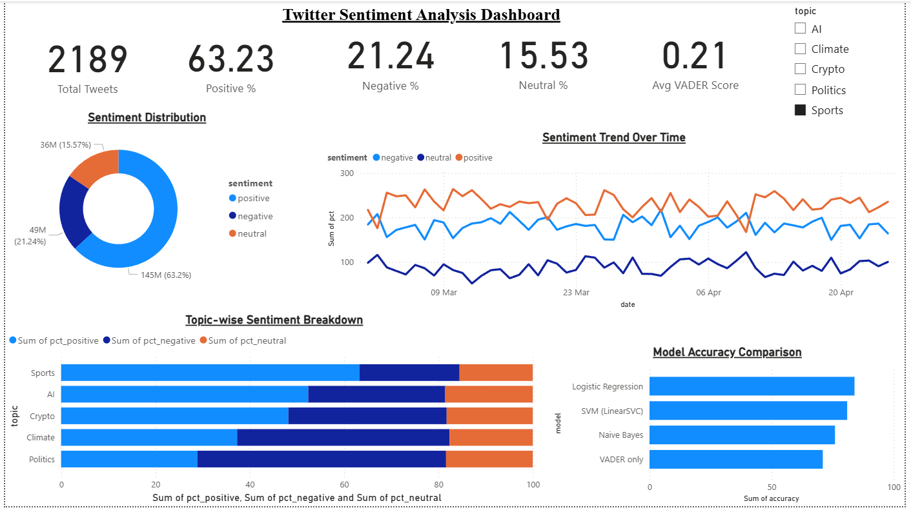

<div align="center">


<br/>


<br/>

> **A production-grade Twitter sentiment analysis pipeline powered by Python, NLTK & VADER — with real-time trend visualization through an interactive Power BI dashboard.**

<br/>

[🚀 Quick Start](#-getting-started) • [📊 Dashboard](#-dashboard-features) • [🗂️ Structure](#-project-structure) • [📸 Screenshots](#-dashboard-screenshots) • [👤 Author](#-author)

</div>

---

## 📌 Overview

This end-to-end NLP pipeline:

- 🔍 **Collects** live tweets via Twitter API v2
- 🧹 **Preprocesses** text with tokenization, stopword removal & lemmatization
- 🧠 **Classifies** sentiment as `Positive`, `Negative`, or `Neutral` using VADER + ML models
- 📤 **Exports** results to Excel for Power BI ingestion
- ⏱️ **Automates** the full pipeline on a scheduled interval

---

## 🗂️ Project Structure

```
twitter-sentiment-powerbi/
│
├── 📄 1_data_collection.py       # Fetches tweets using Twitter API v2
├── 📄 0_xquik_import.py          # Converts Xquik exports into labeled tweet data
├── 📄 2_preprocessing.py         # Cleans, tokenizes & lemmatizes tweet text
├── 📄 3_modeling.py              # Sentiment scoring — VADER + ML models
├── 📄 4_powerbi_export.py        # Exports processed data to Excel for Power BI
├── 📄 5_scheduler.py             # Automates pipeline at scheduled intervals
├── 📄 config.py                  # API keys and configuration settings
├── 📄 requirements.txt           # Python dependencies
│
├── 📁 dashboard/
│   ├── Twitter_Sentiment_Dashboard.pbix      # Power BI dashboard file
│   ├── twitter_sentiment_powerbi.xlsx        # Processed data source
│   └── Screenshots/
│       ├── image1.png                        # All Topics view
│       └── image2.png                        # Sports filter view
│
└── 📄 LICENSE                    # MIT License
```

---

## ⚙️ Tech Stack

<div align="center">

| Layer | Technology | Purpose |
|:---:|:---:|:---|
| 🐦 Data Collection | `Tweepy` + Twitter API v2 | Stream & fetch live tweets |
| 🧹 Preprocessing | `NLTK`, `Regex`, `Pandas` | Clean, tokenize, lemmatize |
| 🧠 Sentiment Engine | `VADER`, `Scikit-learn` | Score & classify sentiment |
| 📊 Visualization | `Microsoft Power BI` | Interactive real-time dashboard |
| 🗄️ Storage | `PostgreSQL`, `Excel (.xlsx)` | Data persistence & Power BI export |
| ⏱️ Automation | `APScheduler` | Cron-based pipeline scheduling |

</div>

---

## 🚀 Getting Started

### Prerequisites

- Python 3.10+
- Twitter Developer Account ([Apply here](https://developer.twitter.com))
- Microsoft Power BI Desktop ([Download](https://powerbi.microsoft.com))

### 1. Clone the Repository

```bash
git clone https://github.com/Technicaladvisor01/twitter-sentiment-powerbi.git
cd twitter-sentiment-powerbi
```

### 2. Install Dependencies

```bash
pip install -r requirements.txt
```

### 3. Configure API Keys

Edit `config.py` with your Twitter Developer credentials:

```python
TWITTER_KEYS = {
    "bearer_token":        "your_bearer_token",
    "api_key":             "your_api_key",
    "api_secret":          "your_api_secret",
    "access_token":        "your_access_token",
    "access_token_secret": "your_access_token_secret",
}
```

> ⚠️ **Never commit real API keys.** Use environment variables or a `.env` file in production.

### 4. Run the Pipeline

```bash
# Optional: convert a Xquik export before the Power BI export step
python 0_xquik_import.py xquik-export.json

# Run each stage individually
python 1_data_collection.py
python 2_preprocessing.py
python 3_modeling.py
python 4_powerbi_export.py

# OR run the fully automated scheduler
python 5_scheduler.py
```

`0_xquik_import.py` accepts Xquik JSON, JSONL, or CSV exports and writes
`data/labeled_tweets.csv`. `4_powerbi_export.py` now loads that file when it is
present, so the Power BI workbook can refresh from real Xquik-backed tweet rows
instead of only generated sample data.

### 5. Open the Dashboard

1. Launch **Power BI Desktop**
2. Open `dashboard/Twitter_Sentiment_Dashboard.pbix`
3. Refresh the data source → point to `dashboard/twitter_sentiment_powerbi.xlsx`
4. Explore live sentiment trends 🎉

---

## 📊 Dashboard Features

<div align="center">

| Feature | Description |
|:---|:---|
| 🔢 **KPI Cards** | Total Tweets, Positive %, Negative %, Neutral %, Avg VADER Score |
| 🍩 **Sentiment Distribution** | Donut chart — Positive / Negative / Neutral breakdown |
| 📈 **Sentiment Trend** | Line chart tracking changes over time (March → April) |
| 📊 **Topic Breakdown** | Stacked bar — AI, Climate, Crypto, Politics, Sports |
| 🤖 **Model Comparison** | Logistic Regression vs SVM vs Naive Bayes vs VADER |
| 🎛️ **Topic Slicer** | Filter all visuals by topic in one click |

</div>

---

## 🖼️ Dashboard Screenshots

### 🌐 Overall View — All Topics


<div align="center">

| Metric | Value |
|:---:|:---:|
| 📋 Total Tweets | **10,000** |
| 😊 Positive | **47.03%** |
| 😠 Negative | **35.32%** |
| 😐 Neutral | **17.65%** |
| 📉 Avg VADER Score | **0.05** |

</div>

---

### ⚽ Filtered View — Sports Topic


<div align="center">

| Metric | Value |
|:---:|:---:|
| 📋 Total Tweets | **2,189** |
| 😊 Positive | **63.23%** |
| 😠 Negative | **21.24%** |
| 😐 Neutral | **15.53%** |
| 📉 Avg VADER Score | **0.21** |

</div>

---

## 📈 Sample Sentiment Output

```
┌────────────────────────────────────┬───────────┬────────┐
│ Tweet                              │ Sentiment │ Score  │
├────────────────────────────────────┼───────────┼────────┤
│ "Loving the new AI update!"        │ Positive  │  0.87  │
│ "This service is absolutely awful" │ Negative  │ -0.72  │
│ "Just saw the announcement."       │ Neutral   │  0.00  │
└────────────────────────────────────┴───────────┴────────┘
```

---

## 🤝 Contributing

Contributions are welcome! Feel free to:

1. Fork the repository
2. Create a feature branch (`git checkout -b feature/your-feature`)
3. Commit your changes (`git commit -m 'Add some feature'`)
4. Push to the branch (`git push origin feature/your-feature`)
5. Open a Pull Request

---

## 📝 License

This project is licensed under the **MIT License** — see the [LICENSE](LICENSE) file for details.

---

## 👤 Author

<div align="center">

**Krishna Rawat**

[](https://github.com/Technicaladvisor01)

<br/>

⭐ **If this project helped you, please consider giving it a star — it means a lot!** ⭐

</div>
